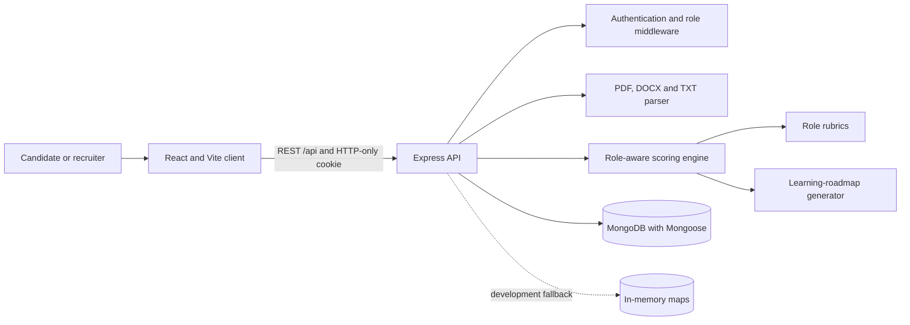

# HireLens AI

HireLens AI is a full-stack, role-aware resume analyser and recruiter decision-support system. It helps candidates understand exactly where a resume is strong, where evidence is missing, how weak lines can be rewritten without inventing facts, and what to study next. Recruiters can create a real job, add real candidates, compare explainable fit signals, review evidence and move applicants through a hiring pipeline.

The project uses a simple MERN-style architecture: React, Express, Node.js and optional MongoDB. Its core scoring system is a deterministic, explainable NLP/rule engine rather than a hidden black-box score. The same inputs and rubric version produce the same result.

> HireLens is decision support, not an automatic hiring decision-maker. Protected traits are excluded from scoring and final decisions remain human-controlled.

## Project highlights

- No dummy scores or candidates: a new account starts empty.
- Separate candidate and employer experiences with role-based access control.
- Resume upload for PDF, DOCX and TXT, plus pasted-text input.
- Seven role families: software, data/ML, finance/MBA, consulting, marketing/sales, design/creative and research.
- Job-description parsing for mandatory, preferred and responsibility statements.
- Nine-category weighted scoring with exact resume-line evidence.
- Skills classified as **demonstrated**, **listed only** or **missing**.
- Truth-safe replacement wording with brackets wherever the user must provide a real fact.
- A personalised learning roadmap with foundations, portfolio proof and interview-readiness phases.
- Recruiter ranking, adjustable weights, candidate stages, blind-screening name/initial masking and profile-based interview questions.
- Email/password authentication, JWT cookies and optional real Google OAuth 2.0.
- MongoDB persistence when configured, with a development-only in-memory fallback.
- Automated scoring regression tests, including grammar and roadmap tests.

## Candidate workflow

1. Register or sign in as a candidate.
2. Upload a resume or paste its text.
3. Enter a target role, seniority and optionally a real job description.
4. Review the overall score and extraction confidence.
5. Open **Detailed analysis** to see category scores, deductions and highlighted resume lines.
6. Open **Suggestions** for priority fixes and complete replacement wording.
7. Open **Job match** to distinguish demonstrated, merely listed and missing skills.
8. Open **Roadmap** for an ordered study plan, estimated effort and portfolio deliverables.

No score appears before step 2. Roadmap completion is saved in the browser for the selected role.

## Recruiter workflow

1. Register or sign in as an employer.
2. Create a job with a title, location and job description.
3. Upload or paste candidate resumes for that job.
4. Review job-specific rankings and the score confidence.
5. Adjust skills, experience, evidence, impact and education weights.
6. Open a candidate to review strengths, weaknesses and resume excerpts.
7. Generate critical questions from that candidate's evidence and gaps.
8. Move the candidate through New, Screened, Shortlisted, Interview, Selected or Rejected.

Candidate search, weight-based reranking, stage updates and blind-screening name/initial masking are functional. The visible stage-filter checkboxes, stage tabs, Compare and Edit rubric controls are UI scaffolds for a later version and are not presented as completed backend workflows.

## Technology stack

| Layer | Technology | Purpose |
|---|---|---|
| Frontend | React 19 | Component-based candidate and recruiter interfaces |
| Routing | React Router 7 | Public, candidate and employer routes |
| Build tooling | Vite 6 | Local development server and production build |
| Icons/charts | Lucide React, Recharts | Interface icons and visualisation support |
| Backend | Node.js 20+, Express 5 | REST API, middleware and business logic |
| Database | MongoDB, Mongoose 8 | Persistent users, jobs, candidates and analyses |
| Authentication | JWT, HTTP-only cookies, bcryptjs | Sessions, password hashing and protected endpoints |
| OAuth | Passport, Google OAuth 2.0 | Optional real Google sign-in |
| Validation | Zod | Authentication request validation |
| Uploads | Multer | In-memory file upload handling with an 8 MB limit |
| Document parsing | pdf-parse, Mammoth | PDF and DOCX text extraction |
| Security/operations | Helmet, CORS, Morgan, dotenv | Security headers, origin control, logging and configuration |
| Testing | Node test runner, Vitest | Deterministic backend tests and frontend test command |
| Package management | pnpm workspaces | One repository containing the client and server packages |

The `openai` SDK and `OPENAI_*` environment variables are present for an optional future constrained explanation service. The current numeric score, rewrites and ranking do **not** call an LLM, so the core project works without an API key and remains reproducible.

## Architecture



The Vite development server proxies `/api` requests to Express on port `4000`. In production, the API and built frontend can be deployed behind the same reverse proxy.

## Explainable scoring

The overall candidate score is a weighted sum of nine category scores:

| Category | Weight |
|---|---:|
| ATS structure | 10% |
| Mandatory match | 20% |
| Role relevance | 20% |
| Skill evidence | 15% |
| Impact | 15% |
| Clarity | 8% |
| Education fit | 5% |
| Consistency | 4% |
| Role presentation | 3% |

The engine preserves resume line numbers, resolves a role-family rubric, checks job requirements, distinguishes a skill list from demonstrated use, detects metrics and outcomes, and returns evidence-linked strengths and deductions. Confidence is displayed separately from fit so a weak parse is not disguised as a trustworthy score.

See [docs/SCORING.md](docs/SCORING.md) for the formula and evaluation plan.

## Quick start

### Requirements

- Node.js 20 or newer
- pnpm 10 or newer
- Optional: MongoDB Community Server or MongoDB Atlas
- Optional: Google Cloud OAuth credentials

### Run locally on Windows

```powershell
cd "C:\Users\ASUS\Desktop\STUDY DOC\PROJECTS\Resume Ranker"
pnpm install
Copy-Item .env.example .env
pnpm dev
```

Open [http://localhost:5173](http://localhost:5173). The API runs at [http://localhost:4000](http://localhost:4000), and its health endpoint is [http://localhost:4000/api/health](http://localhost:4000/api/health).

Use `Ctrl+C` in the terminal to stop both development servers.

### Available commands

```powershell
pnpm dev       # start the React client and Express API
pnpm test      # run backend regression tests and the frontend test command
pnpm build     # create the production frontend build
pnpm start     # start the API without Vite
```

## Environment configuration

Copy `.env.example` to `.env` and set only the integrations you need:

```dotenv
PORT=4000
CLIENT_URL=http://localhost:5173
JWT_SECRET=replace-with-a-long-random-secret
MONGODB_URI=
GOOGLE_CLIENT_ID=
GOOGLE_CLIENT_SECRET=
GOOGLE_CALLBACK_URL=http://localhost:4000/api/auth/google/callback
OPENAI_API_KEY=
OPENAI_MODEL=gpt-4.1-mini
```

### MongoDB

Set `MONGODB_URI` to persist accounts, jobs, candidates and analyses. When it is blank or MongoDB cannot connect, HireLens uses process-memory maps for local development. Memory data disappears when the API restarts and must not be used as production storage.

### Google OAuth

Google sign-in requires credentials from the developer's own Google Cloud project. There is deliberately no dummy OAuth account.

1. Create an OAuth 2.0 **Web application** client in Google Cloud Console.
2. Add `http://localhost:5173` as an authorised JavaScript origin.
3. Add `http://localhost:4000/api/auth/google/callback` as an authorised redirect URI.
4. Set `GOOGLE_CLIENT_ID`, `GOOGLE_CLIENT_SECRET` and a strong `JWT_SECRET` in `.env`.
5. Restart `pnpm dev`.

Without those credentials, email registration/login remains available and the UI states that Google setup is required.

## REST API summary

| Method | Endpoint | Access | Purpose |
|---|---|---|---|
| `GET` | `/api/health` | Public | Database, OAuth and service health |
| `POST` | `/api/auth/register` | Public | Create candidate or employer account |
| `POST` | `/api/auth/login` | Public | Start a cookie-based session |
| `GET` | `/api/auth/google` | Public | Begin Google OAuth |
| `GET` | `/api/auth/me` | Signed in | Return current user |
| `POST` | `/api/auth/logout` | Public | Clear the session cookie |
| `GET` | `/api/analysis/resume/latest` | Candidate | Load latest analysis |
| `POST` | `/api/analysis/resume` | Candidate | Parse and analyse a resume |
| `DELETE` | `/api/analysis/resume/latest` | Candidate | Clear candidate analyses |
| `POST` | `/api/analysis/jd` | Signed in | Extract job-description requirement groups |
| `GET/POST` | `/api/recruiter/jobs` | Employer | List or create jobs |
| `GET` | `/api/recruiter/jobs/:jobId/rankings` | Employer | Rank candidates for a job |
| `POST` | `/api/recruiter/jobs/:jobId/candidates` | Employer | Add and analyse a candidate |
| `POST` | `/api/recruiter/jobs/:jobId/rerank` | Employer | Save weights and rerank candidates |
| `PATCH` | `/api/recruiter/candidates/:candidateId/stage` | Employer | Update hiring stage |
| `POST` | `/api/recruiter/interview-questions` | Employer | Build evidence-based interview questions |

## Repository structure

```text
Resume Ranker/
|-- client/
|   |-- src/components/       authentication, providers, shells and analyser modal
|   |-- src/pages/            candidate, roadmap, recruiter and login pages
|   |-- src/lib/api.js        shared credentialed API helper
|   `-- vite.config.js        Vite and /api proxy configuration
|-- server/
|   |-- src/data/             role-family rubrics
|   |-- src/middleware/       authentication and role checks
|   |-- src/models/           Mongoose schemas
|   |-- src/routes/           authentication, analysis and recruiter APIs
|   |-- src/services/         parsing, scoring, roadmap and auth logic
|   `-- test/                 scoring regression tests
|-- docs/
|   |-- PROJECT_DOCUMENTATION.md
|   |-- INTERVIEW_PREPARATION.md
|   |-- SCORING.md
|   `-- design/               UI reference concepts
|-- .env.example
|-- package.json
`-- README.md
```

## Testing

The backend test suite verifies that:

- strong evidence scores above a weak resume;
- role selection changes the rubric;
- mandatory and preferred requirements are separated;
- skill-list keywords are not counted as demonstrated evidence;
- the strongest skill occurrence is selected;
- truth-safe rewrites do not invent numbers;
- every reported loss has a recommended change;
- vague statements receive evidence-oriented replacements;
- the previously broken `Contributed to worked...` rewrite cannot return;
- the roadmap is generated in the right order from real gaps.

Run `pnpm test` before submitting or demonstrating the project.

## Current limitations and responsible use

- PDF text extraction depends on the PDF containing machine-readable text; scanned images need OCR, which is not implemented.
- Role vocabularies are curated and finite. They are not a substitute for a calibrated labour-market dataset.
- Requirement parsing uses sentence and phrase rules; complex job descriptions may need human review.
- In-memory mode is temporary and resets on restart.
- Roadmap progress is currently browser-local rather than stored in MongoDB.
- Blind screening currently masks the displayed name and initials; filenames and resume excerpts may still contain identity information.
- Approved/rejected rewrite choices are UI state and are not exported into a new resume document.
- The OpenAI SDK is not currently part of the scoring path.
- Production deployment still needs rate limiting, CSRF protection, encrypted file storage, retention/deletion jobs, persistent audit logs, monitoring and an independent bias/fairness evaluation.
- A score must not be used to automatically reject a person.

## Full project documentation

- [System, usability and code guide](docs/PROJECT_DOCUMENTATION.md)
- [Scoring model and evaluation plan](docs/SCORING.md)
- [Interview and viva preparation](docs/INTERVIEW_PREPARATION.md)

## Suggested future work

1. Add OCR for scanned resumes.
2. Persist roadmap and rewrite decisions per user.
3. Complete stage filters, comparison and rubric-editing workflows.
4. Add React component and API integration tests.
5. Create an anonymised labelled evaluation dataset across all role families.
6. Measure extraction precision/recall, ranking NDCG and calibration.
7. Optionally add embeddings for semantic skill matching while preserving visible evidence.
8. Use an LLM only for constrained explanations/rephrasing with schema validation, grounding and audit logs.

## Licence

This repository is an academic project. Add an explicit open-source licence before redistributing it as a public reusable package.
