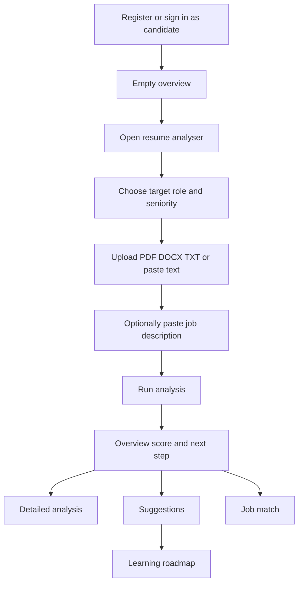
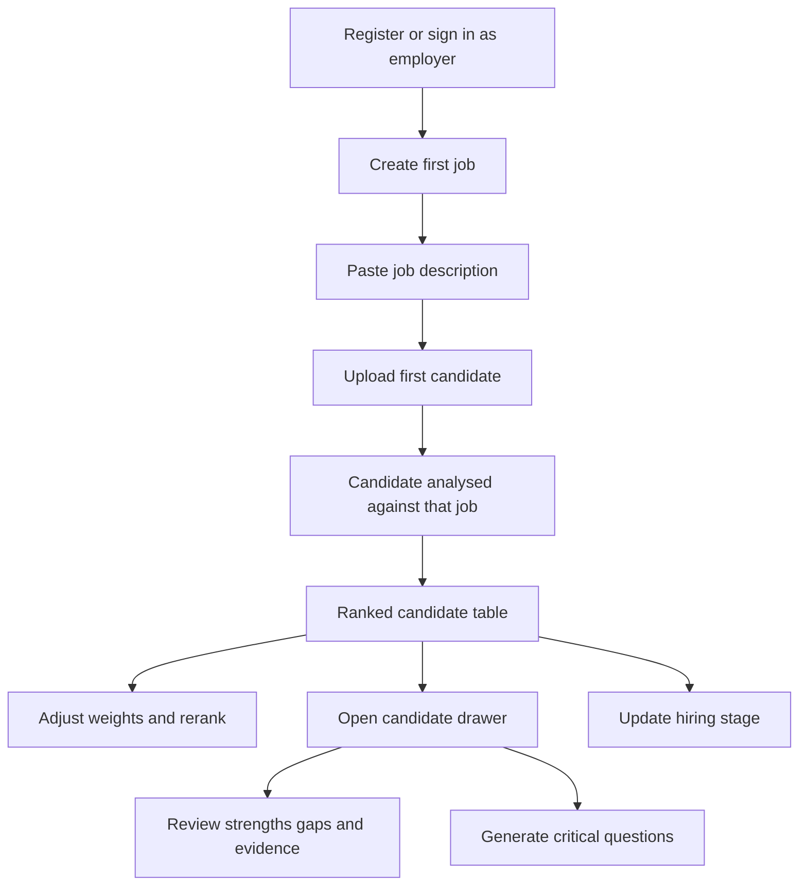
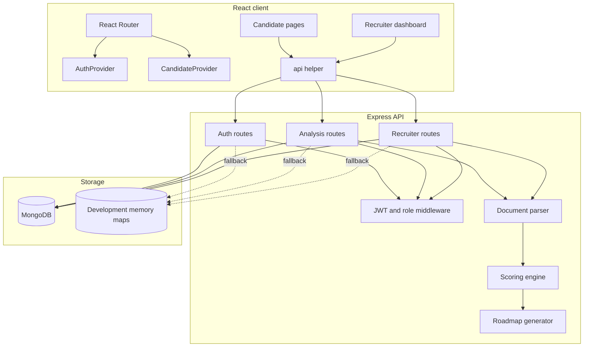
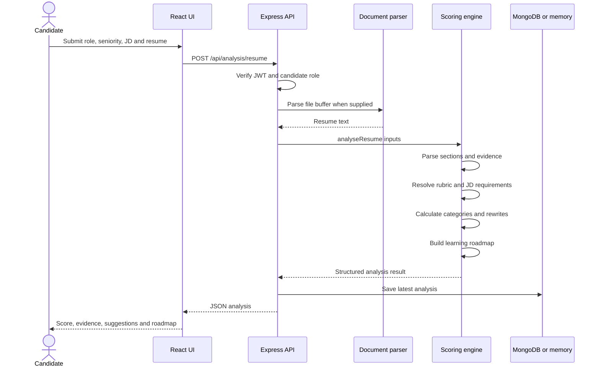

# HireLens AI: Complete Project Documentation

## 1. Project synopsis

### 1.1 Title

**HireLens AI — Explainable Resume Analysis and Recruiter Decision Support**

### 1.2 Abstract

HireLens AI is a full-stack web application for two related users: job candidates and recruiters. A candidate can upload a resume, choose a target role and optionally provide a job description. The system parses the document, selects a role-specific rubric, measures evidence across nine categories and returns an explainable score, exact supporting lines, improvement priorities, safer replacement wording, job-match evidence and a study roadmap.

A recruiter can create a job, upload real candidate resumes, rank candidates against the same job, adjust feature weights, inspect strengths and gaps, generate candidate-specific interview questions, mask displayed names and initials during review and update each hiring stage.

The current core uses deterministic text processing, curated role vocabularies, pattern detection, feature engineering and weighted scoring. This makes its output reproducible and easy to audit. It is not presented as a trained machine-learning model, and it does not let an LLM decide a person's score.

### 1.3 Problem statement

Many resume tools have one or more of these problems:

- They return a score without explaining which resume evidence caused it.
- They treat every profession as if it used the same resume vocabulary.
- They reward keyword stuffing even when a skill appears only in the skills section.
- They suggest achievements or numbers that the candidate never supplied.
- Recruiter tools may begin with fake candidates or hide how rankings were produced.
- Candidates are told what is missing but not what to learn or build next.

HireLens addresses these problems through role-family rubrics, line-linked evidence, demonstrated/listed/missing skill levels, truth-safe templates, separate confidence reporting and an actionable learning roadmap.

### 1.4 Main objectives

1. Analyse resumes only after receiving real user input.
2. Produce different guidance for technical, business, creative and research roles.
3. Separate skill claims from evidence of applying those skills.
4. Explain every important deduction and provide a concrete next action.
5. Improve wording without inventing metrics, titles, employers or achievements.
6. Help candidates convert gaps into a structured learning plan.
7. Help recruiters rank and inspect candidates while retaining human control.
8. Support real authentication and optional database persistence with a manageable MERN stack.

## 2. Scope

### 2.1 Implemented scope

- Candidate and employer registration/login.
- JWT session stored in an HTTP-only cookie.
- Optional Google OAuth 2.0 using Passport.
- Candidate resume upload or text paste.
- PDF, DOCX and TXT text extraction, up to 8 MB.
- Target role, seniority and optional job-description input.
- Role resolution into seven role families.
- Job-description requirement grouping.
- Nine scoring categories and an overall weighted score.
- Separate confidence value.
- Exact-line strengths, deductions and parsed-resume display.
- Evidence-level skill classification.
- Suggested changes and grammar-aware truth-safe rewrites.
- Role-specific learning roadmap and browser-local progress.
- Employer job creation and candidate ingestion.
- Job-specific ranking and weight-based reranking.
- Search by candidate name or skill text.
- Blind-screening name/initial masking.
- Hiring-stage updates.
- Candidate drawer with strengths, gaps, excerpts and interview questions.
- MongoDB persistence and local in-memory fallback.
- Automated scoring regression tests.

### 2.2 Partially scaffolded scope

The recruiter page visually contains stage tabs, stage filter checkboxes, Compare and Edit rubric buttons. Their supporting end-to-end workflows are not completed in the current version. This is intentionally documented instead of describing decorative controls as finished features.

### 2.3 Out of scope in the current version

- OCR for image-only/scanned resumes.
- Automatic rewriting of the original PDF/DOCX file.
- A trained ML ranking model or fine-tuned LLM.
- Automated rejection or selection decisions.
- Email notifications and interview scheduling.
- Production audit-log, retention and consent-management systems.
- Cloud deployment configuration.

## 3. Users and usability

### 3.1 Candidate persona

A student, fresher or experienced employee who wants to target a particular role and needs evidence-based feedback rather than generic resume advice.

Primary needs:

- Know whether the resume is readable and role-relevant.
- See the exact line that caused praise or criticism.
- Receive an improved version of a weak line.
- Avoid fabricated achievements.
- Learn which skill deserves attention next.
- Understand how the resume matches a real job description.

### 3.2 Recruiter persona

An independent recruiter or employer who wants to organise applicants for a job and inspect consistent fit signals without surrendering the final decision to software.

Primary needs:

- Begin with an empty workspace and real job requirements.
- Add candidate resumes to the correct job.
- Rank candidates using visible feature groups.
- Change the weight of those groups.
- Inspect evidence before trusting a score.
- Prepare targeted questions for each candidate.
- Track hiring stages.
- Reduce identity influence during initial screening.

### 3.3 Candidate usability flow



#### Overview page

- Before analysis: shows a clear call to action and no fake score.
- After analysis: shows the latest score, confidence and the highest-priority next step.
- Provides direct links to the detailed pages.

#### Resume-analysis modal

- Requests only information needed to run the analysis.
- Supports file and pasted-text modes.
- Explains that a job description is optional but improves accuracy.
- States that protected traits are excluded.

#### Detailed analysis page

- Displays all nine category scores.
- Lists deductions in priority order.
- Lets the user select a deduction and locate its resume line.
- Shows the rubric version for reproducibility.

#### Suggestions page

- Shows the reason, evidence and recommended change for each loss.
- Displays an ordered skill-development plan.
- Gives a complete replacement structure instead of only saying “improve this”.
- Uses brackets for facts that must come from the candidate.
- Lets the user approve or reject a suggestion during the current UI session.

#### Job-match page

- **Demonstrated:** appears in experience/project evidence with an action or outcome.
- **Listed only:** appears in the resume but lacks a concrete usage example.
- **Missing:** belongs to the selected rubric but was not found.

This distinction discourages keyword stuffing and makes the recommendation easier to defend.

#### Roadmap page

The roadmap contains up to three phases:

1. **Foundations:** critical job-description gaps and missing role signals.
2. **Build proof:** skills that are listed but not demonstrated, with a portfolio deliverable.
3. **Interview readiness:** role-family questions, case practice or behavioural evidence.

Each step contains its reason, estimated effort, a learning task and something the user should build. Completion is stored in browser `localStorage` under `hirelens_roadmap_progress`.

### 3.4 Recruiter usability flow



#### Empty-state behaviour

- A new recruiter sees a job-creation form, not sample applicants.
- A new job shows an upload prompt, not fake rankings.
- A candidate receives a score only after a real resume is supplied.

#### Ranking table

Each row shows:

- Candidate identity or a blind-screening alias.
- Fit score.
- Confidence level and percentage.
- Mandatory-requirement indicator.
- Count of demonstrated-evidence items.
- Hiring-stage dropdown.

#### Adjustable recruiter weights

The recruiter can change:

- Skills: default 35%.
- Experience: default 25%.
- Evidence: default 20%.
- Impact: default 15%.
- Education: default 5%.

The client waits 300 ms after a change before calling the reranking endpoint. This debounce reduces unnecessary API requests during slider movement.

#### Candidate drawer

The drawer provides Overview, Evidence, Notes and Interview tabs. The implemented evidence data comes from exact resume lines. Interview questions are produced from the candidate's strongest evidence, most important gap and a demonstrated skill.

## 4. Functional requirements

| ID | Requirement | Status |
|---|---|---|
| FR-01 | User can register as candidate or employer | Implemented |
| FR-02 | User can log in and log out | Implemented |
| FR-03 | Google OAuth can be configured | Implemented, configuration required |
| FR-04 | Routes enforce the authenticated role | Implemented |
| FR-05 | Candidate can upload or paste a resume | Implemented |
| FR-06 | Candidate can provide role, seniority and JD | Implemented |
| FR-07 | System returns score, confidence and evidence | Implemented |
| FR-08 | System provides complete recommended changes | Implemented |
| FR-09 | Candidate can view an ordered roadmap | Implemented |
| FR-10 | Recruiter can create jobs and add candidates | Implemented |
| FR-11 | Recruiter can rerank using adjustable weights | Implemented |
| FR-12 | Recruiter can update hiring stages | Implemented |
| FR-13 | Recruiter can mask displayed names and initials | Implemented in the UI |
| FR-14 | Recruiter can generate profile-based questions | Implemented |
| FR-15 | Recruiter can filter by stage | UI scaffold only |
| FR-16 | Recruiter can compare selected candidates | UI scaffold only |

## 5. Non-functional requirements

### 5.1 Explainability

Every score category is visible. Important strengths and losses include an evidence object containing a line number and text where possible. The model and rubric versions are returned with each analysis.

### 5.2 Reproducibility

The scoring engine is deterministic. For identical resume text, role, seniority, job description and code version, it returns the same category values. The timestamp differs, but the reasoning does not.

### 5.3 Security

- Passwords are hashed with bcrypt.
- JWTs expire after seven days.
- The session token is stored in an HTTP-only cookie.
- Cookies use `SameSite=Lax`; the `Secure` flag is enabled in production.
- Helmet sets common security headers.
- CORS accepts only the configured client origin and allows credentials.
- Candidate and employer endpoints use role middleware.
- File uploads are kept in memory and limited to 8 MB.
- Zod validates authentication payloads.

Production work still requires CSRF protection, rate limiting, secret rotation, a strict content-security policy, audit logging and an explicit data-retention process.

### 5.4 Performance

- Resume analysis is a single pass over relatively small text plus finite rubric lists.
- Uploaded files are parsed in memory and not written to disk.
- The recruiter re-rank formula uses already stored analysis features; resumes are not reparsed on every slider movement.
- React context shares authentication and latest-analysis state across pages.

### 5.5 Maintainability

- Role vocabularies are isolated in `server/src/data/roleRubrics.js`.
- Roadmap content is isolated in `server/src/services/learningRoadmap.js`.
- API domains are split into auth, analysis and recruiter routers.
- Mongoose models are separate from route logic.
- The client has a shared API helper and context providers.
- Rule regressions are captured in `server/test/scoringEngine.test.js`.

## 6. Technology stack and reasons

### 6.1 React

React is suitable because the product has several stateful views: authenticated routing, modals, selected deductions, recruiter weights, selected candidates, active drawers and roadmap progress. Component reuse keeps the candidate and recruiter shells consistent.

### 6.2 Vite

Vite provides fast development startup, hot-module replacement and a simple production build. Its proxy sends browser calls from `/api` to `http://localhost:4000`, avoiding hard-coded API URLs in components.

### 6.3 Express and Node.js

Using JavaScript on both client and server reduces context switching and keeps the B.Tech implementation approachable. Express middleware is used for JSON parsing, cookies, logging, security headers, authentication and route grouping.

### 6.4 MongoDB and Mongoose

Analysis results contain nested arrays of categories, evidence, skill signals and rewrites. MongoDB's document shape fits this output naturally, while Mongoose provides schemas and query helpers for stable entities such as User, Job and Candidate.

### 6.5 JWT and cookies

The signed JWT contains the user ID, role, email and name. Storing it in an HTTP-only cookie prevents normal client-side JavaScript from reading the token. The backend can also accept a Bearer token, although the React client uses cookies.

### 6.6 Passport Google OAuth

Passport handles the Google authorisation-code flow. OAuth creates or reuses a local HireLens user and then issues the same application JWT used by password accounts. This keeps authorisation consistent after authentication.

### 6.7 pdf-parse and Mammoth

- `pdf-parse` extracts machine-readable text from a PDF buffer.
- `mammoth.extractRawText` extracts raw text from a DOCX buffer.
- TXT input is decoded as UTF-8.

### 6.8 Zod

Zod validates name, email, password and account role at the API boundary. It returns a concise message when registration or login input is invalid.

### 6.9 Explainable NLP/rule engine

The engine uses:

- Normalisation and tokenisation.
- Regular expressions for sections, bullets, contacts, metrics and outcomes.
- Curated aliases for skills such as `node.js` and `node`.
- Job-description sentence classification.
- Feature extraction and bounded scores.
- Weighted aggregation.
- Evidence ranking by resume section and action/outcome quality.

This is best described as an **explainable rule-based NLP baseline with engineered features**. It uses AI-inspired text analysis but is not trained on a dataset.

## 7. System architecture

### 7.1 Component view



### 7.2 Resume-analysis sequence



## 8. Data model

### 8.1 User

| Field | Meaning |
|---|---|
| `name` | Display name |
| `email` | Unique lower-case login email |
| `passwordHash` | bcrypt hash for password accounts |
| `role` | `candidate` or `employer` |
| `organisation` | Employer organisation text |
| `provider` | `password` or `google` |
| `avatar` | Optional OAuth avatar URL |

### 8.2 Job

| Field | Meaning |
|---|---|
| `ownerId` | Employer user ID |
| `title` | Target role/job title |
| `location` | Optional location |
| `description` | Job description used by the scorer |
| `weights` | Recruiter skills/experience/evidence/impact/education weights |

### 8.3 Candidate

| Field | Meaning |
|---|---|
| `ownerId` | Employer who owns the candidate record |
| `jobId` | Job against which the resume was analysed |
| `name` | Candidate name or inferred fallback |
| `fileName` | Original upload name or `Pasted resume` |
| `stage` | Hiring-pipeline stage |
| `analysis` | Complete structured analysis snapshot |

### 8.4 Analysis

| Field | Meaning |
|---|---|
| `userId` | Candidate account ID |
| `targetRole` | User-entered role |
| `seniority` | Selected experience level |
| `score` | Overall score |
| `confidence` | High/Medium/Low label |
| `modelVersion` | Scoring engine version |
| `rubricVersion` | Role-specific rubric version |
| `result` | Complete nested analysis response |

## 9. Scoring and text-analysis design

### 9.1 Role resolution

`resolveRole` maps the user's free-text target to one of:

- Software Engineering
- Data & ML
- Finance & MBA
- Consulting
- Marketing & Sales
- Design & Creative
- Research & Academic

Each rubric supplies relevant terms, evidence verbs and preferred sections.

### 9.2 Resume parsing

The engine:

1. Normalises spaces and line breaks.
2. Removes blank lines while retaining a stable line number.
3. Detects standard section headings.
4. Assigns each line to the current section.
5. Detects bullets, actions, metrics, outcomes, weak openings, vague claims, first-person wording, common spelling mistakes and duplicates.

### 9.3 Skill-evidence levels

For each rubric term, the system searches all matching lines and keeps the strongest occurrence.

- A match in Skills is usually **listed**.
- A match in Experience, Projects, Research, Publications, Leadership, Achievements or Portfolio becomes **demonstrated** when the line also contains an action, outcome or metric.
- No match is **missing**.

The rank `demonstrated = 2`, `listed = 1`, `missing = 0` ensures an earlier skills-list mention cannot hide a stronger project occurrence later in the resume.

### 9.4 Job-description parsing

The job description is split into sentences. Keyword patterns classify each sentence as:

- Mandatory: `must`, `required`, `need`, `minimum`, `essential`.
- Preferred: `preferred`, `nice to have`, `bonus`, `desirable`, `plus`.
- Responsibility: every other non-empty statement.

Requirement signals are drawn from known role skills plus non-stopword phrases. A requirement is considered matched only when enough of its signals are present.

### 9.5 Category formula

For category scores `c_i` and default weights `w_i`, the overall score is:

```text
overall = clamp(sum(c_i * w_i / 100), 0, 100)
```

The exact category definitions are documented in [SCORING.md](SCORING.md).

### 9.6 Confidence

Confidence increases with:

- Number of parsed lines.
- Presence of a job description.
- Number of expected sections found.
- Number of bullet lines.

Confidence is not the same as resume quality. A poor resume can be parsed with high confidence, and a visually complex resume may have a lower-confidence score even if the candidate is strong.

### 9.7 Truth-safe rewrites

The rewrite generator never invents a number. It detects weak openings and creates a role-specific structure. For example:

```text
Original:
Worked with tools and libraries including Pandas, NumPy, SQL and MongoDB for data analysis

Suggested structure:
Analyzed [specific dataset or business problem] using Pandas, NumPy, SQL and MongoDB,
producing [verified insight, model, or decision].
```

Square brackets are an explicit honesty boundary: the candidate must replace them with facts they can defend.

### 9.8 Roadmap generation

`buildLearningRoadmap` consumes `skillDevelopment` rather than independently guessing subjects.

- Critical and medium-priority gaps enter Foundations.
- Remaining listed/missing items enter Build proof.
- A role-family map supplies three Interview readiness tasks.
- Known skills have curated learn/build instructions.
- Unknown skills receive a generic but actionable fallback.

## 10. Recruiter ranking

The resume is analysed once against the job. `featureScore` then groups category scores:

```text
skills     = average(Mandatory match, Role relevance, Skill evidence)
experience = average(Role relevance, Impact)
evidence   = average(Skill evidence, Consistency)
impact     = average(Impact, Clarity)
education  = Education fit
```

Recruiter fit is a normalised weighted sum of these five features. Changing a slider changes the aggregation, not the underlying resume evidence. Candidates are sorted by descending fit and assigned a rank.

## 11. API design

### 11.1 Authentication endpoints

- `POST /api/auth/register`
- `POST /api/auth/login`
- `GET /api/auth/providers`
- `GET /api/auth/google`
- `GET /api/auth/google/callback`
- `GET /api/auth/me`
- `POST /api/auth/logout`

### 11.2 Candidate analysis endpoints

- `GET /api/analysis/resume/latest`
- `POST /api/analysis/resume`
- `DELETE /api/analysis/resume/latest`
- `POST /api/analysis/jd`

The resume endpoint accepts `multipart/form-data` fields:

| Field | Required | Notes |
|---|---|---|
| `resume` | Either file or text | PDF, DOCX or TXT |
| `resumeText` | Either text or file | Full resume text |
| `targetRole` | Yes in UI | Free-text target title |
| `seniority` | Yes in UI | Selected level |
| `jobDescription` | No | Improves mandatory matching |

### 11.3 Recruiter endpoints

- `GET /api/recruiter/jobs`
- `POST /api/recruiter/jobs`
- `GET /api/recruiter/jobs/:jobId/rankings`
- `POST /api/recruiter/jobs/:jobId/candidates`
- `POST /api/recruiter/jobs/:jobId/rerank`
- `PATCH /api/recruiter/candidates/:candidateId/stage`
- `POST /api/recruiter/interview-questions`

Every recruiter route first applies both authentication and employer-role middleware.

## 12. Important implementation excerpts

These excerpts are short explanations of the most defensible project decisions. The complete source remains the authority.

### 12.1 Credentialed API helper

File: `client/src/lib/api.js`

```js
export async function api(path, options = {}) {
  const response = await fetch(`/api${path}`, {
    credentials: "include",
    headers: options.body instanceof FormData
      ? undefined
      : { "Content-Type": "application/json", ...options.headers },
    ...options
  });
  const data = await response.json().catch(() => ({}));
  if (!response.ok) throw new Error(data.message || "Something went wrong.");
  return data;
}
```

Why it matters: every component gets consistent cookie handling, JSON parsing and error propagation. `FormData` is allowed to set its own multipart boundary.

### 12.2 Role-based middleware

File: `server/src/middleware/auth.js`

```js
export function requireRole(role) {
  return (req, res, next) => req.user?.role === role
    ? next()
    : res.status(403).json({ message: `This area is only available to ${role} accounts.` });
}
```

Why it matters: hiding a client route is not security. The server independently rejects a candidate calling recruiter APIs and vice versa.

### 12.3 Strongest evidence wins

File: `server/src/services/scoringEngine.js`

```js
function getSkillEvidence(sectionLines, skill) {
  const occurrences = sectionLines.filter((entry) => containsTerm(entry.text, skill));
  const ranked = occurrences.map((entry) => {
    const inEvidenceSection = EXPERIENCE_SECTIONS.test(entry.section);
    const demonstrated = inEvidenceSection &&
      (ACTION_VERBS.test(entry.text) || METRIC.test(entry.text) || OUTCOME.test(entry.text));
    return { entry, level: demonstrated ? "demonstrated" : "listed", rank: demonstrated ? 2 : 1 };
  }).sort((a, b) => b.rank - a.rank);
  // The returned result uses the highest-ranked occurrence.
}
```

Why it matters: mentioning React in Skills is not equivalent to “Built a React checkout used by three teams”. The latter provides stronger evidence and must control classification.

### 12.4 Weighted overall score

File: `server/src/services/scoringEngine.js`

```js
const score = clamp(
  categories.reduce(
    (total, category) => total + category.score * category.weight / 100,
    0
  )
);
```

Why it matters: every contribution is inspectable. There is no hidden coefficient from an unknown model.

### 12.5 Password and OAuth convergence

Files: `server/src/services/authService.js` and `server/src/routes/auth.js`

Password and Google authentication both return the same safe user shape and issue the same seven-day JWT. This separates authentication provider choice from application authorisation.

### 12.6 MongoDB fallback

The application checks `mongoose.connection.readyState === 1`. It uses MongoDB when connected and process-memory maps otherwise. This makes college demos easier, but persistence-dependent tests and production deployment must use MongoDB.

### 12.7 Roadmap progress

File: `client/src/pages/CandidateRoadmapPage.jsx`

```js
const STORAGE_KEY = "hirelens_roadmap_progress";

useEffect(() => {
  localStorage.setItem(STORAGE_KEY, JSON.stringify(progressStore));
}, [progressStore]);
```

Why it matters: progress survives browser reloads without increasing backend complexity. The trade-off is that it does not sync across devices.

## 13. Error and empty-state handling

- API errors return `{ message }` with suitable 400, 401, 403 or 404 status codes.
- The shared API helper turns non-success responses into JavaScript errors.
- Forms display the message without navigating away.
- Loading states show a spinner.
- Candidate pages show an analysis-first prompt when no analysis exists.
- Recruiters see job-first and candidate-first prompts.
- Old analyses without roadmap data show a reanalyse prompt.

## 14. Testing strategy

### 14.1 Current automated tests

`server/test/scoringEngine.test.js` uses the Node test runner and strict assertions. It checks:

- Score ordering between strong and weak resumes.
- Correct role-family resolution.
- Mandatory/preferred JD grouping.
- No fabricated numeric rewrite.
- Listed versus demonstrated skill evidence.
- Strongest occurrence selection.
- Missing mandatory requirement guidance.
- Suggested changes for every loss.
- Replacement of unverifiable personality claims.
- Grammar regression for “Worked with...” data bullets.
- Ordered roadmap generation.
- Exclusion of generic JD fragments from roadmap skills.

### 14.2 Recommended next tests

- API integration tests with a temporary MongoDB instance.
- Authentication cookie and role-authorisation tests.
- React tests for empty, loading, error and success states.
- File-parser tests using representative PDFs and DOCX files.
- Recruiter reranking and stage-update tests.
- Accessibility checks and keyboard navigation tests.
- Browser tests for registration through analysis and recruiter ingestion.

## 15. Accuracy and evaluation plan

The present tests prove deterministic rules, not real-market predictive validity. A proper research evaluation should:

1. Gather at least 100 anonymised or synthetic resume/JD pairs across all seven role families.
2. Ask at least two reviewers to label each skill as missing, listed or demonstrated.
3. Label mandatory-requirement matches and pairwise ranking preferences.
4. Report inter-rater agreement.
5. Measure extraction precision, recall and F1.
6. Measure ranking NDCG@5 or pairwise accuracy.
7. Measure calibration error between displayed score ranges and reviewer assessments.
8. Compare against keyword-only and TF-IDF/cosine baselines.
9. Review false-positive evidence carefully because unsupported skill claims are especially harmful.
10. Break results down by role family and seniority.

## 16. Ethical and responsible-use considerations

- Protected traits are not scoring features.
- Blind screening masks displayed names and initials, although filenames and evidence text can still identify a person; production de-identification requires redacting them too.
- A score is accompanied by confidence and evidence.
- Unsupported claims are not encouraged.
- The recruiter sees a decision-support notice.
- No automatic rejection endpoint exists.

Before real hiring use, the project needs independent fairness evaluation, legal review, accessibility testing, candidate consent, deletion controls, retention limits and appeal/correction mechanisms.

## 17. Deployment notes

### Development

```powershell
pnpm install
Copy-Item .env.example .env
pnpm dev
```

### Production preparation

1. Build the frontend with `pnpm build`.
2. Serve `client/dist` through a static host or reverse proxy.
3. Run the Express API with `NODE_ENV=production`.
4. Configure `CLIENT_URL`, `JWT_SECRET` and `MONGODB_URI`.
5. Use HTTPS so secure cookies are transmitted.
6. Set the production Google callback in Google Cloud when OAuth is enabled.
7. Add rate limits, CSRF controls, monitoring and backups.
8. Do not use the in-memory fallback.

## 18. Limitations

1. Curated role terms may miss synonyms and emerging technologies.
2. Regex requirement parsing cannot fully understand every complex sentence.
3. PDFs with unusual columns may have poor extracted reading order.
4. Image-only PDFs are unsupported.
5. Seniority is recorded but currently has limited effect on scoring thresholds.
6. Roadmap effort estimates are guidance, not measured learning-time predictions.
7. Recruiter interview questions are template-generated rather than LLM-generated.
8. Roadmap progress and suggestion approvals are client-local.
9. No real labour-market dataset is currently used.
10. The visible recruiter comparison/filter controls require completion.

## 19. Future enhancements

### Short term

- Complete stage filters and stage-tab behaviour.
- Complete candidate comparison.
- Add rubric editing and validation.
- Persist roadmap and rewrite decisions.
- Add export to a revised DOCX resume.
- Add client and API integration tests.

### Medium term

- Add OCR and better layout-aware parsing.
- Add semantic aliases using embeddings.
- Add explainable skill taxonomy mappings.
- Add calibrated score bands based on labelled evaluation data.
- Add encrypted resume storage with expiry/deletion jobs.

### Advanced research

- Compare the rule engine against TF-IDF, sentence embeddings and a learning-to-rank baseline.
- Use an LLM only to generate grounded explanations from structured evidence.
- Validate every LLM response with a schema and reject unsupported claims.
- Add bias audits, counterfactual testing and per-role calibration reports.

## 20. One-minute viva explanation

> HireLens AI is a MERN-style resume-analysis and recruiter-support platform. The candidate uploads a resume, selects a role and may add a job description. The Express backend extracts text from PDF, DOCX or TXT, maps the role to one of seven rubrics, calculates nine explainable features and links strengths or deductions to exact resume lines. It also separates listed skills from demonstrated skills, generates truth-safe replacements and creates a learning roadmap. Employers can create jobs, rank uploaded candidates, adjust feature weights, review evidence, generate profile-based interview questions and update pipeline stages. Authentication uses JWT HTTP-only cookies, bcrypt and optional Google OAuth, while MongoDB is optional for persistence. The present core is a deterministic rule-based NLP baseline, not a trained black-box ML model, which makes it reproducible and easy to defend.
